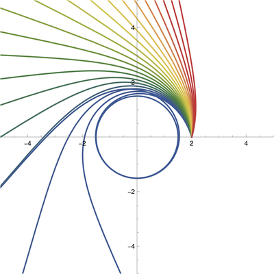

# Black Hole Raytracer
> [!WARNING]  
> This is a **legacy project** which I wrote in 2015, before the first gravitational waves were detected! The coding standards are not that great, and it was also written just to get something that works and uses my own approach, rather than reading the [Interstellar papers](https://arxiv.org/abs/1502.03808) and copying their approach. It is stupidly slow and unoptimized as well, I think it still takes 10 minutes per frame even on 2024 hardware.

## 2015 compilation instructions

> To run it on linux, make sure cimg-dev and libx11-dev are installed ("sudo apt-get install cimg-dev libx11-dev") then type "make" and "./program".

## My Approach
The [Interstellar papers](https://arxiv.org/abs/1502.03808) work with spherical symmetry and exploit Killing vectors and conserved quantities to have some elegant integration code.
I had a bunch of rendering code laying around using xyz coordinates, and I didn't want to convert between $(x,y,z)$ and $(r,\theta,\varphi)$ coordinates all the time! Fortunately, the Schwarzschild metric is actually quite nice in xyz coordinates. Here are the first components of $g^{\mu\nu}$ in the (- + + +) convention, where $r=\sqrt{x^2+y^2+z^2}$ and I omitted the z column because you can carry on the pattern yourself. Don't take my word for it, this is derived using computer algebra in the Mathematica notebook [math.nb]() which you can view in pdf format [math.pdf]().

$$g^{\mu\nu}=\begin{bmatrix}{ccc}
 \frac{1}{-1+1/r} & 0 & 0 \\
0 & 1-\frac{x^2}{r^3} & -\frac{xy}{r^3}\\
0 & -\frac{xy}{r^3} & 1-\frac{y^2}{r^3} 
\end{bmatrix}$$

Using this we can integrate ray trajectories directly in "Cartesian" coordinates. For example:




The formulas for $t''(\tau)$, $x''(\tau)$, $y''(\tau)$, and $z''(\tau)$ are as follows, where I note that $\tau$ is not the proper time but parameterizes the lightlike curve $(t,x,y,z)$. Also: the formulas are presented here as a joke, because they are awful. Feel free to laugh along with me. Yes this is actually in the code.

``` C++
double ddt = -((dt*(dx*x + dy*y + dz*z))/((Power(x,2) + Power(y,2) + Power(z,2))*(-1 + Sqrt(Power(x,2) + Power(y,2) + Power(z,2)))));

double ddx = (x*(Power(dx,2)*Power(x,2)*Sqrt(Power(x,2) + Power(y,2) + Power(z,2)) + 2*dx*dz*x*z*Sqrt(Power(x,2) + Power(y,2) + Power(z,2)) + Power(dz,2)*Power(z,2)*Sqrt(Power(x,2) + Power(y,2) + Power(z,2)) + 2*dx*dz*x*z*(-2 + 3*Power(x,2) + 3*Power(y,2) + 3*Power(z,2)) - Power(dz,2)*(2*(-1 + Power(x,2) + Power(y,2))*(Power(x,2) + Power(y,2)) + (Power(x,2) + Power(y,2))*Power(z,2) - Power(z,4)) + Power(dt,2)*(-1 + Power(x,2) + Power(y,2) + Power(z,2))*(-Power(x,2) - Power(y,2) - Power(z,2) + Sqrt(Power(x,2) + Power(y,2) + Power(z,2))) + 2*dy*y*(dx*x + dz*z)*(-2 + 3*Power(x,2) + 3*Power(y,2) + 3*Power(z,2) + Sqrt(Power(x,2) + Power(y,2) + Power(z,2))) + Power(dx,2)*(2*(Power(y,2) + Power(z,2)) + (Power(x,2) + Power(y,2) + Power(z,2))*(Power(x,2) - 2*(Power(y,2) + Power(z,2)))) + Power(dy,2)*(-2*Power(x,4) + Power(y,4) + 2*Power(z,2) - 2*Power(z,4) - Power(x,2)*(-2 + Power(y,2) + 4*Power(z,2)) + Power(y,2)*(-Power(z,2) + Sqrt(Power(x,2) + Power(y,2) + Power(z,2))))))/(2.*(-1 + Power(x,2) + Power(y,2) + Power(z,2))*Power(Power(x,2) + Power(y,2) + Power(z,2),2.5));

double ddy = (y*(Power(dx,2)*Power(x,2)*Sqrt(Power(x,2) + Power(y,2) + Power(z,2)) + 2*dx*dz*x*z*Sqrt(Power(x,2) + Power(y,2) + Power(z,2)) + Power(dz,2)*Power(z,2)*Sqrt(Power(x,2) + Power(y,2) + Power(z,2)) + 2*dx*dz*x*z*(-2 + 3*Power(x,2) + 3*Power(y,2) + 3*Power(z,2)) - Power(dz,2)*(2*(-1 + Power(x,2) + Power(y,2))*(Power(x,2) + Power(y,2)) + (Power(x,2) + Power(y,2))*Power(z,2) - Power(z,4)) + Power(dt,2)*(-1 + Power(x,2) + Power(y,2) + Power(z,2))*(-Power(x,2) - Power(y,2) - Power(z,2) + Sqrt(Power(x,2) + Power(y,2) + Power(z,2))) + 2*dy*y*(dx*x + dz*z)*(-2 + 3*Power(x,2) + 3*Power(y,2) + 3*Power(z,2) + Sqrt(Power(x,2) + Power(y,2) + Power(z,2))) + Power(dx,2)*(2*(Power(y,2) + Power(z,2)) + (Power(x,2) + Power(y,2) + Power(z,2))*(Power(x,2) - 2*(Power(y,2) + Power(z,2)))) + Power(dy,2)*(-2*Power(x,4) + Power(y,4) + 2*Power(z,2) - 2*Power(z,4) - Power(x,2)*(-2 + Power(y,2) + 4*Power(z,2)) + Power(y,2)*(-Power(z,2) + Sqrt(Power(x,2) + Power(y,2) + Power(z,2))))))/(2.*(-1 + Power(x,2) + Power(y,2) + Power(z,2))*Power(Power(x,2) + Power(y,2) + Power(z,2),2.5));

double ddz = (z*(Power(dx,2)*Power(x,2)*Sqrt(Power(x,2) + Power(y,2) + Power(z,2)) + 2*dx*dz*x*z*Sqrt(Power(x,2) + Power(y,2) + Power(z,2)) + Power(dz,2)*Power(z,2)*Sqrt(Power(x,2) + Power(y,2) + Power(z,2)) + 2*dx*dz*x*z*(-2 + 3*Power(x,2) + 3*Power(y,2) + 3*Power(z,2)) - Power(dz,2)*(2*(-1 + Power(x,2) + Power(y,2))*(Power(x,2) + Power(y,2)) + (Power(x,2) + Power(y,2))*Power(z,2) - Power(z,4)) + Power(dt,2)*(-1 + Power(x,2) + Power(y,2) + Power(z,2))*(-Power(x,2) - Power(y,2) - Power(z,2) + Sqrt(Power(x,2) + Power(y,2) + Power(z,2))) + 2*dy*y*(dx*x + dz*z)*(-2 + 3*Power(x,2) + 3*Power(y,2) + 3*Power(z,2) + Sqrt(Power(x,2) + Power(y,2) + Power(z,2))) + Power(dx,2)*(2*(Power(y,2) + Power(z,2)) + (Power(x,2) + Power(y,2) + Power(z,2))*(Power(x,2) - 2*(Power(y,2) + Power(z,2)))) + Power(dy,2)*(-2*Power(x,4) + Power(y,4) + 2*Power(z,2) - 2*Power(z,4) - Power(x,2)*(-2 + Power(y,2) + 4*Power(z,2)) + Power(y,2)*(-Power(z,2) + Sqrt(Power(x,2) + Power(y,2) + Power(z,2))))))/(2.*(-1 + Power(x,2) + Power(y,2) + Power(z,2))*Power(Power(x,2) + Power(y,2) + Power(z,2),2.5));
```

